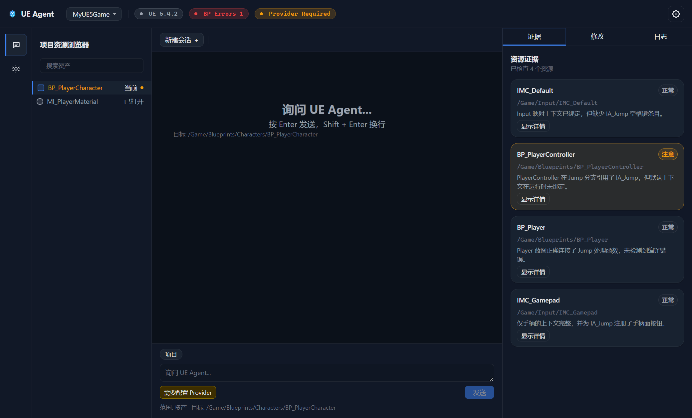
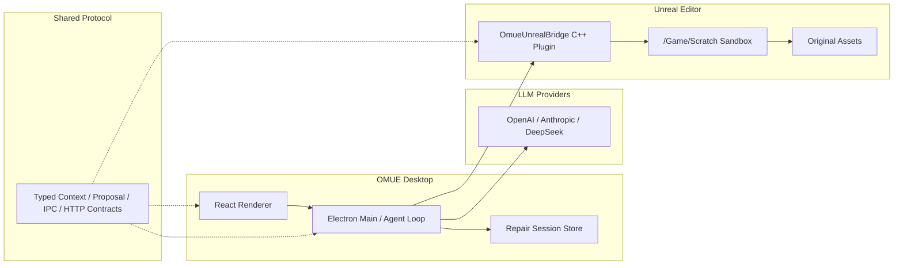

# OMUE — Oh My UE

> **A safety-first AI agent workbench for Unreal Engine 5**
>
> 面向 UE5 的受限自主 Agent 工作台：读取真实编辑器上下文，在沙箱中验证修复，并由开发者审批后写回原资产。


[](https://github.com/XLingyyy/Oh-My-Unreal-Engine/actions/workflows/ci.yml)




## OMUE 是什么

排查 Blueprint 问题时，工程信息、当前资产、编译错误、日志和图结构分散在 Unreal Editor 的不同面板里。把这些内容交给通用聊天模型，还要靠开发者手工整理上下文，并承担模型直接修改资产的风险。

OMUE 在 UE Editor 外提供一个独立桌面工作台。它通过 C++ Bridge 读取编辑器上下文，将信息整理成结构化证据，再交给 Agent 诊断。涉及资产修改时，修复先落到 `/Game/Scratch/` 下的沙箱副本，通过编译验证和人工审批后，才允许写回原资产。

它不是一个套在 UE 外面的聊天窗口。上下文采集、提议校验、执行边界、会话恢复和审批记录都属于工作流本身。

## 核心工作流


## 当前能力

| 能力 | 说明 |
| --- | --- |
| UE 上下文采集 | 读取工程、当前资产、日志、编译状态、Blueprint 摘要、图结构与图细节 |
| 结构化诊断 | 将 Blueprint 和错误信息组织为 Agent 可消费、可追踪的证据 |
| 双 Scope 会话 | Project Scope 只做工程级诊断；Asset Scope 才能进入资产修复流程 |
| Agent Loop | 管理诊断、提议、Typed Payload 校验、预检、沙箱、编译、审批和 Promote 状态 |
| 沙箱先行 | 写操作先作用于 `/Game/Scratch/` 副本，不直接修改原始 Blueprint |
| 桌面工作台 | 提供项目资源、Agent 会话、诊断卡片、修改预览、证据、日志和设置界面 |
| 模型配置 | 支持 OpenAI、Anthropic、DeepSeek 提议链路，API Key 由 Main 进程统一管理 |
| Mock / Real 模式 | 无 UE 环境时使用 Mock 开发；Real 模式连接本地 Unreal Editor Bridge |
| 中英文界面 | 默认中文，支持中英文即时切换和设置持久化 |

UE Bridge 当前暴露 15 个业务路径，覆盖只读上下文、能力发现、沙箱写入、复制、编译和回滚协议。

## 安全边界

OMUE 把“模型提出修改”和“允许修改资产”分成两个阶段。

| 会话范围 | 可以做什么 | 不能做什么 |
| --- | --- | --- |
| Project Scope | 读取工程上下文、分析问题、推荐候选资产 | 生成可执行写入、进入沙箱、编译修改、审批或 Promote |
| Asset Scope | 针对明确资产生成修复提议，并在验证后请求审批 | 绕过目标校验、直接修改非白名单路径、自动 Promote |

- LLM 输出必须通过 Typed Payload、目标路径和字段级校验。
- Renderer 隐藏危险操作时，Main 进程仍会独立执行 Scope 和状态校验。
- 沙箱目标必须位于 `/Game/Scratch/`，并满足命名和能力白名单。
- Promote 是独立审批动作，不会因为沙箱编译成功而自动执行。
- 失败、重试、升级和关闭原因会写入 Repair Session，便于恢复和审计。

## 工程实现

### 分层架构



| 模块 | 职责 |
| --- | --- |
| `apps/desktop` | Electron 桌面应用、Agent Loop、Repair Session、审批和工作台 UI |
| `packages/shared-protocol` | 上下文、提议、设置、HTTP 与 IPC 的共享类型契约 |
| `plugins/OmueUnrealBridge` | UE Editor 上下文采集和受限本地 HTTP API |

### 值得关注的实现点

- **契约先行**：桌面端、Main 进程和 UE Bridge 通过共享类型约束数据边界。
- **持久化状态机**：Repair Session 支持中断恢复、失败记录、审批和终态追踪。
- **确定性 UI 映射**：同一组会话事实和事件会生成稳定的 Agent 卡片 ID、顺序和内容。
- **真实模式不偷换 Mock**：真实 Bridge 失败时展示降级或错误状态，不用示例数据伪装成功。
- **秘密保护**：Provider Authority、API Key Vault 和错误详情脱敏都在 Main 侧执行。
- **面向失败设计**：超时、协议错误、上下文缺失、非法 Scope 和恢复动作都有明确结果。

## 工程验证

以下命令已在当前仓库执行通过：

```powershell
npm run test:agent-ui  # 400 tests passed
npm run typecheck
npm run build
```

| 指标 | 当前结果 |
| --- | --- |
| 自动化测试 | 400 / 400 通过 |
| Agent UI 测试文件 | 18 个 |
| UE Bridge 业务路径 | 15 个 |
| TypeScript 类型检查 | 通过 |
| Desktop 生产构建 | 通过 |

测试覆盖会话校验、Project/Asset Scope 隔离、提议 Schema、确定性卡片映射、真实上下文降级、Provider Authority、设置安全、语言持久化和工作台状态一致性。

## 当前状态

项目处于 **Alpha** 阶段。

已经具备：

- 可运行的桌面 Agent 工作台和 Mock 开发链路。
- UE C++ Bridge、真实只读上下文和 Blueprint 诊断端点。
- Asset Repair Session、沙箱复制、沙箱应用、编译、审批和 Promote 代码路径。
- Provider 配置、会话恢复、安全状态展示和自动化回归测试。

仍需完成：

- 真 UE + 真模型环境下的端到端 Promote 重复验证。
- 可执行 Rollback 的本地 UE 验证；当前回滚协议和记录已存在，但不能视为稳定能力。
- 安装包、发布流程和正式版本兼容矩阵。

这意味着 OMUE 适合作为可运行的工程原型和 UE Agent 架构实验项目，暂不建议用于重要生产资产。

## 快速启动

### 前置条件

- Windows
- Node.js 22.12 或更高版本
- npm

### Mock 模式

```powershell
git clone https://github.com/XLingyyy/Oh-My-Unreal-Engine.git
cd Oh-My-Unreal-Engine
npm install
npm run dev:desktop
```

桌面端默认使用 Mock 模式，不要求本机正在运行 Unreal Editor，适合查看工作台和调试交互。

### Real Bridge 模式

先将 [`plugins/OmueUnrealBridge`](plugins/OmueUnrealBridge/README.md) 部署到 UE5 工程并启动 Editor，再运行：

```powershell
$env:VITE_OMUE_BRIDGE_MODE="real"
$env:VITE_OMUE_BRIDGE_BASE_URL="http://127.0.0.1:21805"
npm run dev:desktop
```

完整 Agent 修复还需要在桌面设置中配置可用的模型 Provider。Real 模式目前面向开发和本地验证，不是开箱即用的发布版本。

## 文档

| 主题 | 文档 |
| --- | --- |
| 架构与模块边界 | [docs/architecture.md](docs/architecture.md) |
| 开发路线图 | [docs/development-roadmap.md](docs/development-roadmap.md) |
| 安全与回滚 | [docs/safety-and-rollback.md](docs/safety-and-rollback.md) |
| UE Bridge | [plugins/OmueUnrealBridge/README.md](plugins/OmueUnrealBridge/README.md) |
| Shared Protocol | [packages/shared-protocol/README.md](packages/shared-protocol/README.md) |

## 下一步

1. 完成真 UE Promote 和 Rollback 的端到端本地验证。
2. 增加安装包和正式发布流程。
3. 扩展经过白名单审查的 Blueprint 修复操作。
4. 补充真实修复会话的演示视频或 GIF。
