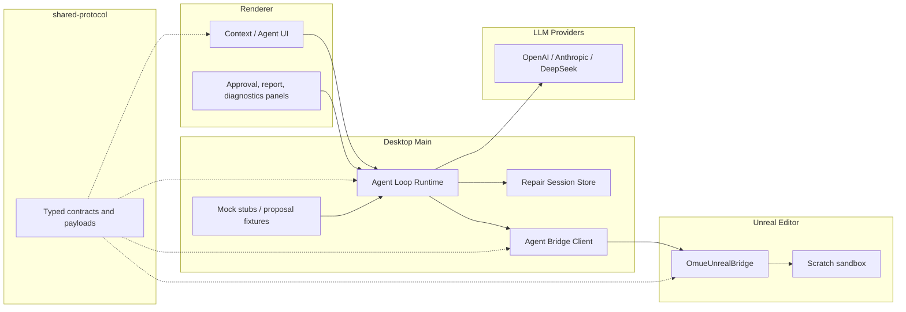

# OMUE 架构文档

## 产品定位

OMUE 是面向 Unreal Engine 5 的专用 Agent 工作台。它把 Unreal Editor 上下文采集、LLM 修复提议、沙箱验证和人工审批 promote 串成一个受限自主闭环，让 Agent 能在明确安全边界内推进编译修复，而不是把模型直接接到原资产写操作。

核心价值不是“让模型自己改”，而是让提议、执行、验证和回滚都进入结构化流程：

```text
读取上下文
-> 生成 typed proposal
-> schema / preflight 校验
-> duplicate 到 sandbox
-> sandbox apply
-> sandbox compile
-> human approval
-> promote 到原资产
-> 验证 / 回滚 / 报告
```

## 模块划分

### 运行时架构



## 模块职责表

| Module | Responsibility | Does Not Do |
| --- | --- | --- |
| `apps/desktop/src/renderer` | 展示上下文、编译状态、Agent 会话、差异预览、审批与报告 UI | 不绕过 Main / bridge 直接操作 UE |
| `apps/desktop/src/main` | 承载 Agent Loop、Repair Session Store、LLM 调用、bridge 编排与状态机推进 | 不直接修改 UE 二进制资产，不跳过审批闸门 |
| `apps/desktop/src/main/agent-loop-runtime.ts` | 组织 proposing / validating / sandbox / approval / promoting 流程 | 不定义共享协议 schema |
| `apps/desktop/src/main/agent-bridge-client.ts` | Main 侧 bridge 访问封装，协调 duplicate / sandbox apply / compile / promote | 不负责 UI 展示 |
| `apps/desktop/src/main/repair-session-store.ts` | 会话持久化、恢复、状态追踪与失败记录 | 不执行业务写入 |
| `apps/desktop/src/main/agent-proposal-fixtures.ts` 与 `agent-loop-mock-stubs.ts` | Mock 流程、fixture 与本地无 UE 验证支撑 | 不参与真实 UE 执行 |
| `plugins/OmueUnrealBridge` | 采集 UE 上下文、暴露 bridge endpoint、执行受限白名单写操作 | 不做黑箱 mutate，不省略 preflight |
| `packages/shared-protocol` | 定义上下文、typed payload、capability discovery、bridge / IPC contract | 不承载桌面端或 UE 端业务逻辑 |

## Agent Loop 层

Agent Loop 是本次转型后的关键新增层，位于桌面端 Main 进程，核心文件包括：

- `apps/desktop/src/main/agent-loop-runtime.ts`
- `apps/desktop/src/main/agent-bridge-client.ts`
- `apps/desktop/src/main/repair-session-store.ts`
- `apps/desktop/src/main/agent-proposal-fixtures.ts`
- `apps/desktop/src/main/agent-loop-mock-stubs.ts`

这一层负责：

- 管理 Repair Session 生命周期。
- 调用 LLM 生成编译修复提议。
- 验证 typed payload、记录 proposal failure。
- 协调 sandbox duplicate、sandbox apply、sandbox compile。
- 在通过验证后挂起到 `awaiting_approval`，等待人批准 promote。
- 记录验证、升级和恢复信息，保证会话可 resume。

它是“Agent 能力”真正落地的位置，也是受限自主策略的主要执行层。

## 数据流

### 只读上下文流

```text
Renderer -> Main -> Bridge -> Unreal Editor
        <- typed context snapshot / logs / compile status <-
```

这条链路负责把项目、资产、Blueprint 摘要、图细节、日志和编译状态提取成桌面端可消费的结构化数据。

### Agent 修复流

```text
Renderer request
-> Main Agent Loop
-> LLM propose fix
-> typed payload validation
-> Bridge duplicate to scratch
-> Bridge sandbox apply
-> Bridge sandbox compile
-> await human approval
-> Bridge promote to original asset
-> verification / report / rollback path
```

该流程强调三点：

- LLM 输出只作为提议，必须经过 typed 校验。
- 写操作先进入沙箱，先验证再决定是否 promote。
- promote 是单独的人审批动作，而不是 sandbox 成功后的自动延续。

## 设计边界

当前架构有意维持以下边界：

- Renderer 只负责展示与用户交互，不直接执行业务写操作。
- Main 侧统一承接 Agent Loop，避免 renderer 中散落高风险编排逻辑。
- 所有 UE 读写都经过 bridge，避免桌面端绕开 allowlist 与 preflight。
- shared-protocol 是 typed contract 的唯一来源，但不是状态机实现层。
- 安全、审批、回滚是架构能力的一部分，而不是 UI 之后再补的流程。

## 为什么先做 Agent Loop 再谈更强自动化

OMUE 的重点不是尽快增加更多模型能力，而是先把“提议 -> 沙箱 -> 编译 -> 审批 -> promote”这条链路打磨成可靠的最小闭环。只有当：

- typed payload 稳定，
- sandbox 写入与 compile 可验证，
- 会话可恢复，
- promote 有明确人审批，

更强的自动修复能力才具备继续扩展的基础。
